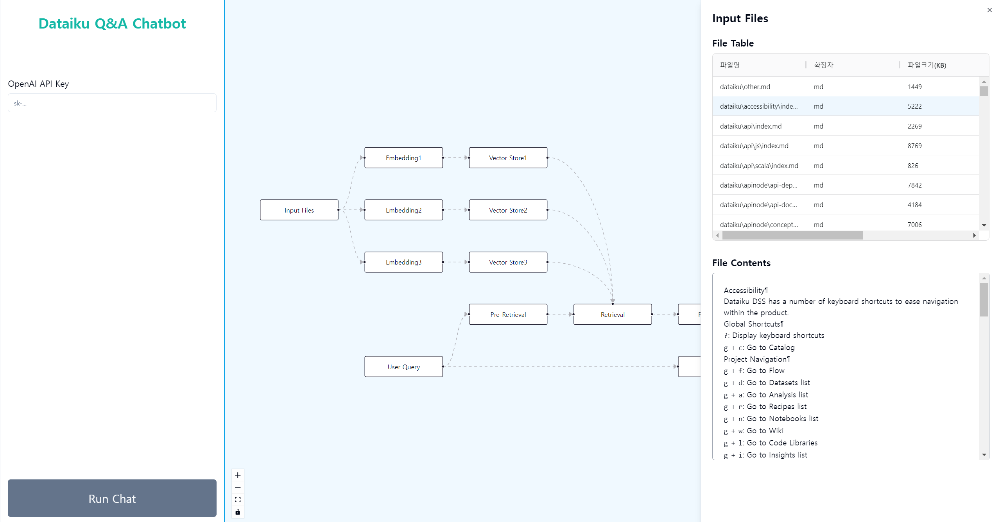
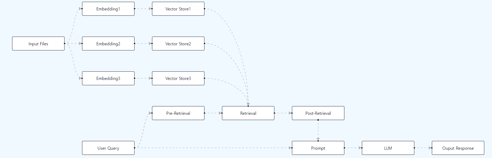

# Dataiku Q&A Chatbot

Main page

Total Process

## Introduction

This is an MVP of a Q&A chatbot web application designed to answer questions using Dataiku document data. The chatbot service leverages a RAG (Retrieval-Augmented Generation) process and a Large Language Model (LLM), with Reactflow integrated to provide a clear visualization of the process flow. The llama-index framework was utilized to build the core chatbot functionality.

## TODO

-   Design and implement the user interface for the Chat page
-   Design and build the database schema (PostgreSQL)
-   Set up a vector store using pgvector for efficient similarity searches
-   Develop the chat process from User Query to Output Response
-   Add local LLM model(llama3, solar etc) serving via Ollama
